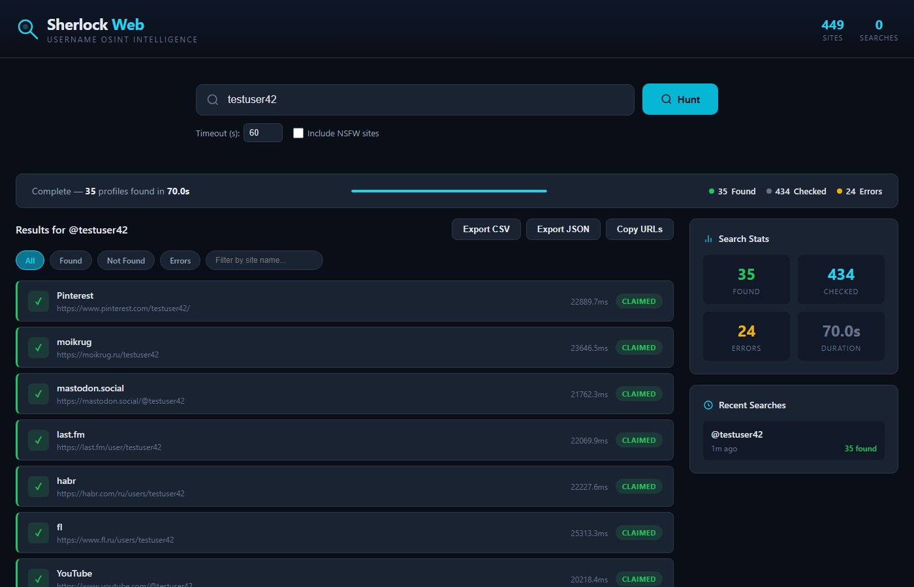
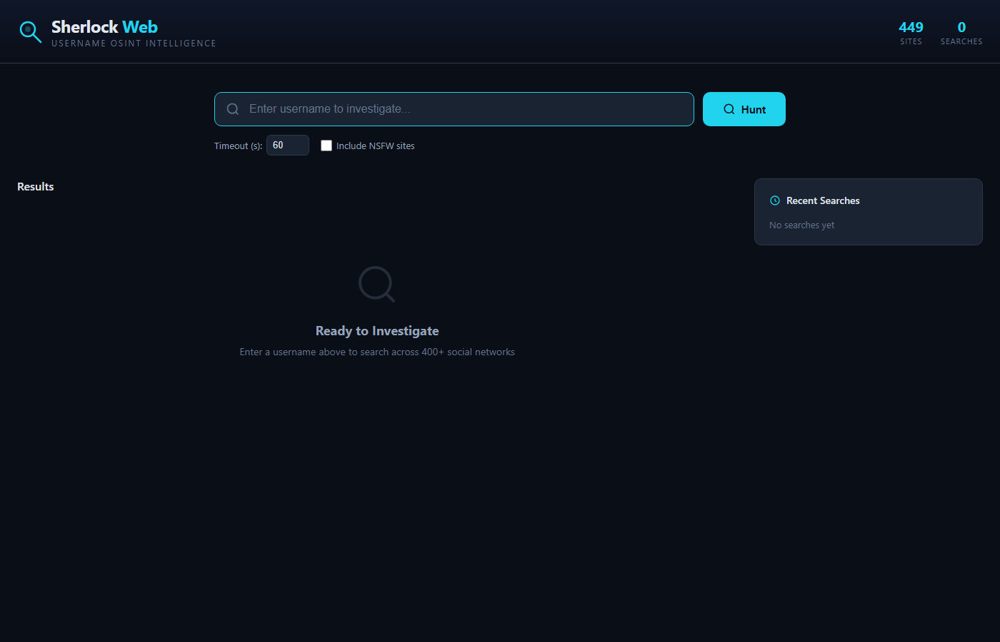
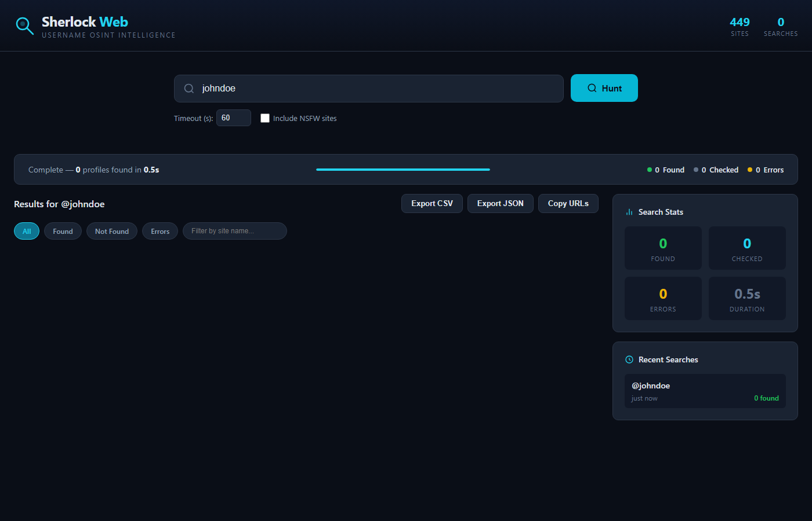
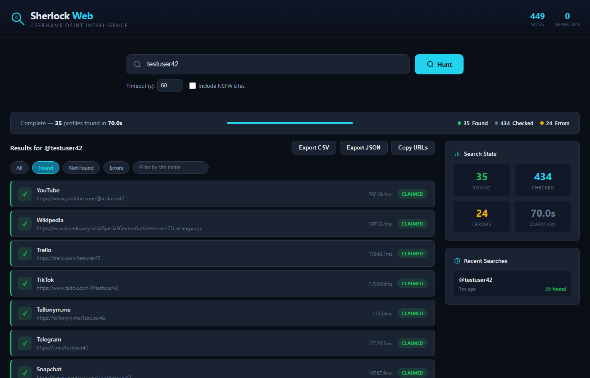

# Sherlock Web UI — Enhanced by KCCS

> A self-hosted web interface for [Sherlock](https://github.com/sherlock-project/sherlock) OSINT username searches with real-time WebSocket streaming, search history, and result export.



## What's New in This Fork

- **Web UI** -- Full browser-based interface, no CLI needed
- **Real-time WebSocket streaming** -- Results appear as they're found, not after the full scan completes
- **Search history** -- Every search is saved to SQLite with full results and timestamps
- **Export** -- Download results as CSV, JSON, or copy all found URLs to clipboard
- **Dark OSINT theme** -- Purpose-built dark interface for investigative work
- **Docker ready** -- Single `docker compose` command to deploy

## Quick Start

### Docker (Recommended)

```bash
git clone https://github.com/pueblokc/sherlock.git
cd sherlock
docker compose -f docker-compose.web.yml up -d
# Open http://localhost:8501
```

### Local Install

```bash
git clone https://github.com/pueblokc/sherlock.git
cd sherlock
python -m venv venv
source venv/bin/activate  # Windows: venv\Scripts\activate
pip install -e .
pip install fastapi "uvicorn[standard]" websockets

python -m uvicorn sherlock_web.app:app --host 0.0.0.0 --port 8501
# Open http://localhost:8501
```

## Screenshots

| Landing Page | Search in Progress |
|:---:|:---:|
|  |  |

| Search Complete | Found Filter |
|:---:|:---:|
|  |  |

## Features

### Real-Time Streaming
Results stream to your browser via WebSocket as each site is checked. No waiting for 449+ sites to finish before seeing anything.

### 449+ Sites
Searches all sites from the official Sherlock database. Toggle NSFW sites on/off from the UI.

### Search History
Every search is persisted to SQLite. Browse past searches, view full results, and export any time.

### Filter & Sort
Filter results by status -- Found, Not Found, or Errors. Search by site name within results.

### Export Options
- **CSV** -- Spreadsheet-ready export
- **JSON** -- Structured data for automation
- **Clipboard** -- Copy all found URLs with one click

### Configurable Timeout
Adjust the per-site timeout directly from the UI. Default is 60 seconds.

## API Reference

| Method | Endpoint | Description |
|--------|----------|-------------|
| `GET` | `/` | Web UI |
| `WS` | `/ws/search` | WebSocket for real-time search |
| `GET` | `/api/sites` | List all 449+ searchable sites |
| `GET` | `/api/history` | Search history |
| `GET` | `/api/search/{id}` | Get search results by ID |
| `GET` | `/api/search/{id}/export/csv` | Export results as CSV |
| `GET` | `/api/search/{id}/export/json` | Export results as JSON |

### WebSocket Protocol

Connect to `/ws/search` and send:

```json
{
  "username": "target_username",
  "timeout": 60,
  "nsfw": false,
  "sites": null
}
```

Receive streamed results:

```json
{"type": "started", "search_id": 1, "username": "target_username"}
{"type": "result", "site_name": "GitHub", "url_user": "https://github.com/target", "status": "CLAIMED", "response_time_ms": 234.5}
{"type": "done"}
```

Status values: `CLAIMED` (found), `AVAILABLE` (not found), `UNKNOWN` (error), `WAF` (blocked), `ILLEGAL` (invalid username for site)

## Docker

```bash
# Build and run
docker compose -f docker-compose.web.yml up -d

# Or build manually
docker build -f Dockerfile.web -t sherlock-web .
docker run -p 8501:8501 sherlock-web
```

## Environment Variables

| Variable | Default | Description |
|----------|---------|-------------|
| `SHERLOCK_PORT` | `8501` | Server port |
| `SHERLOCK_DB_PATH` | `./sherlock_web.db` | SQLite database path |

## Architecture

```
sherlock_web/
├── app.py          # FastAPI backend with WebSocket streaming
├── database.py     # SQLite for search history & results
├── __init__.py
├── requirements.txt
└── static/
    └── index.html  # Single-file dark-theme frontend
```

The web UI wraps the existing `sherlock_project` core without modifying it. A custom `WebSocketNotifier` extends `QueryNotify` to stream results in real-time via WebSocket instead of printing to terminal.

---

## Original Project

<details>
<summary>Click to expand original Sherlock README</summary>

<p align="center">
  <br>
  <a href="https://sherlock-project.github.io/" target="_blank"></a>
  <br>
  <span>Hunt down social media accounts by username across <a href="https://sherlockproject.xyz/sites">400+ social networks</a></span>
  <br>
</p>

<p align="center">
  <a href="https://sherlockproject.xyz/installation">Installation</a>
  &nbsp;&nbsp;&nbsp;&bull;&nbsp;&nbsp;&nbsp;
  <a href="https://sherlockproject.xyz/usage">Usage</a>
  &nbsp;&nbsp;&nbsp;&bull;&nbsp;&nbsp;&nbsp;
  <a href="https://sherlockproject.xyz/contribute">Contributing</a>
</p>

## Installation

| Method | Notes |
| - | - |
| `pipx install sherlock-project` | `pip` may be used in place of `pipx` |
| `docker run -it --rm sherlock/sherlock` | |
| `dnf install sherlock-project` | |

## General usage

To search for only one user:
```bash
sherlock user123
```

To search for more than one user:
```bash
sherlock user1 user2 user3
```

## Credits

Thank you to everyone who has contributed to Sherlock!

## License

MIT &copy; Sherlock Project
Original Creator - [Siddharth Dushantha](https://github.com/sdushantha)

</details>

---

Developed by **[KCCS](https://kccsonline.com)** | Web UI by [@pueblokc](https://github.com/pueblokc) | [kccsonline.com](https://kccsonline.com)
